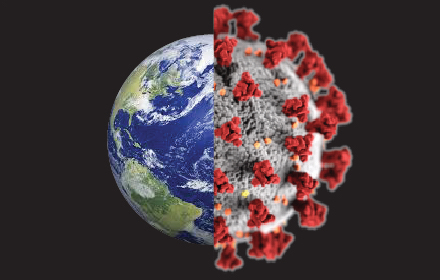

# coronavirus-to-climate-change

The Climate Change Chrome extension changes every mention of “coronavirus” that you encounter while browsing to “climate change.”

This plug-in does not exist to mock people who have suffered as a result of COVID-19. We do not aim to undermine the impact of the virus.
Rather, we created this plug-in with the intention of highlighting the amazing ability of humans to organize and collectively work together to overcome problems.
Imagine if governments world-wide moved beyond rhetoric and took meaningful action.
This free plug-in will work on all browsers.

The Climate Change Plug-In was created by Pierre Faniel ([@PierreFaniel](https://twitter.com/PierreFaniel)) and Alex Ketchum ([@aketchum22](https://twitter.com/aketchum22)).
